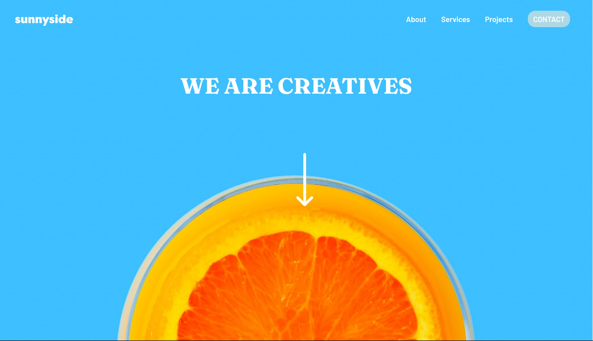
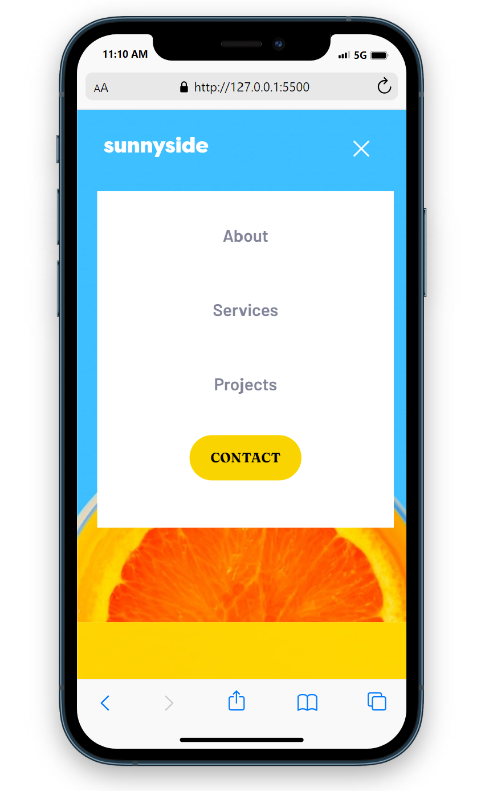

# Frontend Mentor - Sunnyside agency landing page solution

This is a solution to the [Sunnyside agency landing page challenge on Frontend Mentor](https://www.frontendmentor.io/challenges/sunnyside-agency-landing-page-7yVs3B6ef).


### The challenge

- View the optimal layout for the site depending on users device's screen size
- See hover states for all interactive elements on the page


### Screenshot





### Links

- Solution URL: [Add solution URL here](https://github.com/Aanu-TT/sunnyside-agency-landing-page.git)
- Live Site URL: [Add live site URL here](https://your-live-site-url.com)

## My process

### Built with

- Semantic HTML5 markup
- CSS custom properties
- Flexbox
- CSS Grid


### What I learned

```css
.proud-of-this-css {
    .hamburger--menu:has(input:checked)::before{
        rotate: 45deg;
        width: var(--x-width);
        translate: 0 calc(var(--bar-height) / -2);
    }

    in the root:

    --hamburger-height: calc(var(--bar-height)* 3 + var(--hamburger-gap) * 2);

}
```


## Author


- Frontend Mentor - [@Aanu-TT](https://www.frontendmentor.io/profile/Aanu-TT)
- Twitter - [@aanu_tt](https://www.twitter.com/AanuTT)
